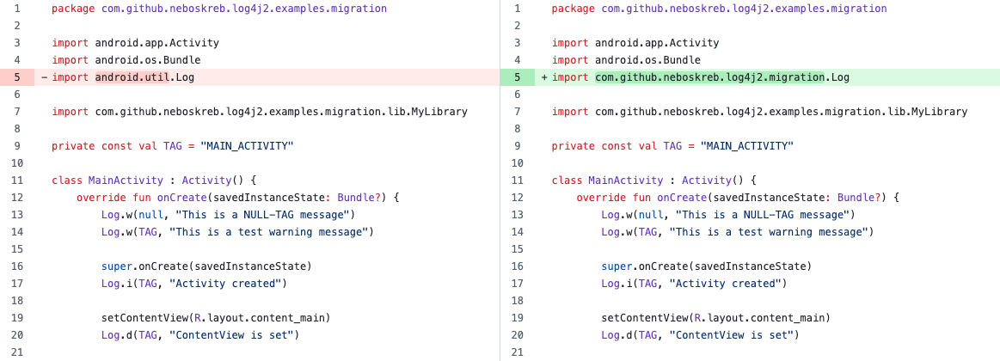
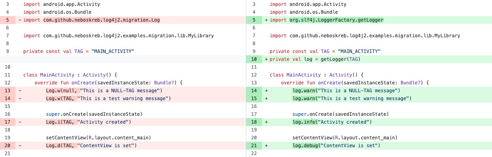

# Migrating from Android's Log to SLF4J

This article describes how to migrate an existing library/app to the proper SLF4J logging with the minimal impact to 
your development process. It assumes that a team of developers is working on the code while the migration is performed.
In case of a solo developer, the steps can be merged.

--------

Migration is a three-step process:
1) Add the migration package to switch from Android's `Log` to SLF4J, thus gaining control over the logging.
   Note that though this step allows for quick results, it comes with performance hit. Therefore, proceed to step 2
   as soon as your workload permits.

---- at this point the log control works ----

2) Once the logging works well, replace all `Log.x(...)` calls with proper SLF4J logging. 

3) Once all sources are treated, remove the migration package.


# 1. Applying the migration package

The migration package provides class `Log` which is a wrapper for SLF4J facade. Once employed, it redirects your used-to-be Android logs to SLF4J.
Hence, you can now control the logging using `log4j2.properties` configuration.

The contract and signature of class `Log` is identical to Android's `Log`. Therefore, you need to replace only
the `import` statement without changing any lines in the code - it will recompile without any errors. 


Such a minimal footprint allows the migration to be performed as a non-blocking task while the team continues working on
other features. In the unlikely event of a merge conflict, the imports are trivial to resolve.


## For a library

> See commit [How to migrate a library](https://github.com/neboskreb/android-log4j2/commit/3ddb6f67a91eee53658d2b2c655daa0fc22e40b8) for the detailed changes.

* Add the SLF4J dependency and the migration package:
  ```groovy
  dependencies {
      implementation 'org.slf4j:slf4j-api:[2.0.17, 3.0)'
      implementation 'io.github.neboskreb:android-log4j2-migration:2.0'
  }
  ```

* Replace `import android.util.Log` with `import com.github.neboskreb.log4j2.migration.Log` in all source files.

### Tests (optional)

Normally, you don't need to change anything because by default SLF4J prints nothing, which is the desired behaviour in tests.

However, if you _do_ need to see test logs, you have the control now. Add `android-log4j2` library as test dependency: 
```groovy
dependencies {
    testImplementation 'io.github.neboskreb:android-log4j2:2.24'

    androidTestImplementation 'io.github.neboskreb:android-log4j2-junit5:2.24'
}
```

Create configuration files `log4j2.properties` in the [proper folders](/README.md#location-of-config-files) for JUnit and Android tests.

JUnit tests will work without changes in code. For Android tests, add `@ExtendWith` [if you use JUnit 5](/README.md#junit-5) or `@Rule` [in case of JUnit 4](/README.md#junit-4).


## For an app

> See commit [How to migrate an app](https://github.com/neboskreb/android-log4j2/commit/7614fa008022a5cf62b9ef338d4adb49ae9556e4) for the detailed changes.

* Add the SLF4J library and the migration package:
  ```groovy
  dependencies {
      implementation 'io.github.neboskreb:android-log4j2-migration:2.0'
      implementation 'io.github.neboskreb:android-log4j2:2.24'
      // Though android-log4j2 brings Log4J2 in as a transitive dependency,
      // it is always a good idea to pin the exact version:
      implementation 'org.apache.logging.log4j:log4j-core:2.24.3'
      implementation 'org.apache.logging.log4j:log4j-slf4j2-impl:2.24.3'
  }
  ```

* Replace `import android.util.Log` with `import com.github.neboskreb.log4j2.migration.Log` in all source files.

* Add initialization to your `App` class:
  ```kotlin
  import net.loune.log4j2android.AndroidLog4jHelper
  
  class App : Application() {
      override fun onCreate() {
          super.onCreate()
  
          AndroidLog4jHelper.initialize(applicationContext)
      }
  }
  ```

### Tests (optional)

Normally, you don't need to change anything because by default SLF4J prints nothing, which is the desired behaviour in tests.

However, if you _do_ need to see test logs, follow the same instructions as in [library](#tests-optional).


### Bypassing the SLF4J (optional)

By default, `Log` wrapper redirects your logs to SLF4J facade, from whence they are sent to Log4j engine.
If you want, `Log` can send the logs directly to Log4j bypassing the SLF4J. This will give a performance improvement 
(though very small, frankly). It is worth applying only if your app logs _heavily_. 

This option is activated as follows:
```kotlin
class App : Application() {
    init {
        // Force Log to invoke the Log4j calls directly, bypassing the SLF4J facade.
        Log.useLog4j2()
    }
    ...
}
```


# 2. Replacing the Log calls

Add creating the logger with `log = getLogger(...)`, and replace all `Log.x(...)` calls with corresponding `log.xxx(...)`:



This footprint is bigger. It might result in conflicts if the module which is being migrated is under active
development. In such case, postpone the replacement until the module is stabilised. Calls `Log.x(...)` and `log.xxx(...)`
can co-exist in the same code without problems.

# 3. Removing the migration package

Run a global search for `import android.util.Log` and make sure it returns no results.

Delete dependency `io.github.neboskreb:android-log4j2-migration:2.0` from your Gradle script. Rebuild the project.
You should get no compiler errors; otherwise make sure you didn't miss a `Log.x(...)` call somewhere.


# Performance considerations

The `Log` wrapper internally calls `getLogger(...)` every time a line `Log.x(...)` is executed. This is by far less
optimal than having the logger created once in the beginning, which is the standard approach. 

However, the decision to replace or to keep it should be based on your business priorities and performance targets.
In some cases steps 2 and 3 might be not economically worth of executing.